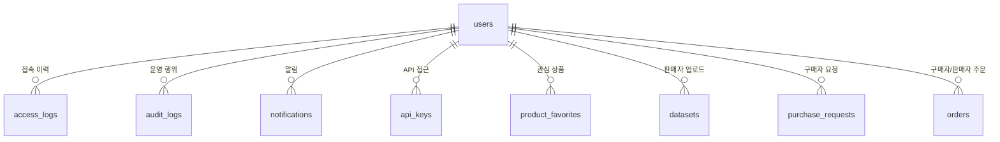

# 사용자 및 권한 관리 DB 테이블 정리

## 핵심 구조

사용자/권한 관리는 `users` 테이블이 중심입니다. 역할 기반 권한은 `users.role` 값으로 판단하고, 계정 사용 가능 여부는 `users.status` 값으로 판단합니다.

## users

사용자 계정의 기준 테이블입니다.

| 컬럼 | 의미 |
| --- | --- |
| `id` | 사용자 ID |
| `name` | 사용자 이름 |
| `email` | 로그인 이메일, UNIQUE |
| `password_hash` | 비밀번호 해시 |
| `company` | 회사명 |
| `phone` | 연락처 |
| `role` | 권한 역할: `ADMIN`, `USER` |
| `status` | 계정 상태: `ACTIVE`, `SUSPENDED` |
| `created_at` | 가입 시각 |

현재 권한 판단:
- `ADMIN`: 관리자 화면, 승인/반려, CSV export, 백업, 로그 조회 가능
- `USER`: 일반 판매자/구매자 기능 사용
- `ACTIVE`: 로그인 가능
- `SUSPENDED`: 로그인 차단

## access_logs

접속 이력 전용 로그입니다.

| 컬럼 | 의미 |
| --- | --- |
| `id` | 로그 ID |
| `user_id` | 사용자 ID, 실패 로그인은 없을 수 있음 |
| `email` | 시도한 이메일 |
| `event_type` | `LOGIN_SUCCESS`, `LOGIN_FAIL`, `LOGOUT` |
| `failure_reason` | 실패 사유 |
| `ip_address` | 접속 IP |
| `user_agent` | 브라우저/클라이언트 정보 |
| `created_at` | 발생 시각 |

관리자 화면:
- `/web/admin/access-logs`

## audit_logs

관리자/사용자의 주요 운영 행위를 추적합니다.

| 컬럼 | 의미 |
| --- | --- |
| `id` | 로그 ID |
| `actor_user_id` | 행위자 사용자 ID |
| `action` | 행위 코드 |
| `target_type` | 대상 유형 |
| `target_id` | 대상 ID |
| `detail_json` | 상세 정보 |
| `ip_address` | 요청 IP |
| `created_at` | 발생 시각 |

주요 action:
- `USER_ACTIVATED`
- `USER_SUSPENDED`
- `DATASET_APPROVED`
- `DATASET_REJECTED`
- `DATASET_PUBLISHED`
- `PRODUCT_UPDATED`
- `PRODUCT_HIDDEN`
- `PURCHASE_APPROVED`
- `API_KEY_ISSUED`
- `API_KEY_REVOKED`
- `DATABASE_BACKUP_DOWNLOADED`

관리자 화면:
- `/web/admin/audit-logs`

## notifications

사용자별 알림 테이블입니다.

| 컬럼 | 의미 |
| --- | --- |
| `id` | 알림 ID |
| `recipient_user_id` | 수신자 ID |
| `category` | 알림 분류 |
| `title` | 제목 |
| `message` | 내용 |
| `target_type` | 연결 대상 유형 |
| `target_id` | 연결 대상 ID |
| `read_at` | 읽은 시각 |
| `created_at` | 생성 시각 |

## api_keys

구매 승인 이후 API 접근 권한을 관리합니다.

| 컬럼 | 의미 |
| --- | --- |
| `id` | API Key ID |
| `purchase_request_id` | 구매 요청 ID |
| `product_id` | 상품 ID |
| `user_id` | API 사용자 ID |
| `token_hash` | API Key 해시 |
| `token_prefix` | 표시용 접두부 |
| `total_request_limit` | 전체 호출 제한 |
| `monthly_request_limit` | 월 호출 제한 |
| `status` | `ACTIVE`, `INACTIVE` |
| `created_at` | 발급 시각 |

보안 기준:
- 원문 API Key는 DB에 저장하지 않음
- API 요청은 `X-API-Key` 헤더만 허용
- query string API Key는 거부

## product_favorites

사용자 관심 상품입니다.

| 컬럼 | 의미 |
| --- | --- |
| `id` | 즐겨찾기 ID |
| `product_id` | 상품 ID |
| `user_id` | 사용자 ID |
| `created_at` | 저장 시각 |

제약:
- `(product_id, user_id)` UNIQUE

## 권한 체크 요약

| 기능 | 권한 기준 |
| --- | --- |
| 관리자 화면 | `current_user.role == "ADMIN"` |
| 계정 활성/정지 | 관리자만 가능 |
| 관리자 본인 정지 | 차단 |
| 상품 수정/비공개 | 관리자 또는 상품 판매자 |
| 구매 요청 상세 | 관리자, 구매자, 판매자 |
| 샘플 다운로드 | 관리자, 판매자, 구매/결제 완료 구매자 |
| API 샘플 호출 | 유효한 API Key + 구매/결제 완료 |
| 접속 이력 조회 | 관리자만 가능 |
| 감사 로그 조회 | 관리자만 가능 |

## 개선 후보

현재 `role`은 단일 문자열입니다. 향후 세분화가 필요하면 아래 테이블을 추가할 수 있습니다.

| 후보 테이블 | 목적 |
| --- | --- |
| `roles` | 역할 마스터 관리 |
| `permissions` | 기능 단위 권한 관리 |
| `role_permissions` | 역할별 권한 매핑 |
| `user_roles` | 사용자 다중 역할 지원 |
| `user_sessions` | 활성 세션/강제 로그아웃 관리 |
| `login_lockouts` | 로그인 실패 누적 및 계정 잠금 |

MVP 현재 단계에서는 `users.role` + `users.status` 방식이 단순하고 충분합니다. 다만 관리자/운영자/정산담당/검토자처럼 역할이 늘어나면 RBAC 테이블로 분리하는 것이 좋습니다.
